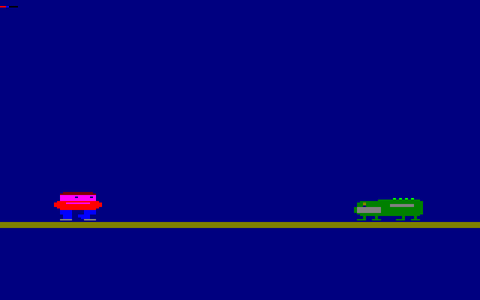

# Schneider CPC 6128 Emulator (Z80 Core)

> **Quick Links:** [Technical Reference](REFERENCE.md) | [Development Log](LOGBOOK.md) | [Programs](programs)

---

A C++17 emulation of the Zilog Z80 CPU targeting the Schneider/Amstrad CPC 6128 hardware, with a live SDL3 monitor for real-time video output.



*Milestone 10: Uncle Alligator (green, left) and the Hero (red shirt, right) move toward each other across the screen. Sprites pass through each other for now — collision detection arrives in M12.*

---

## The Vision: AI & Reinforcement Learning

The goal of this project is to build a lightweight, modular CPC 6128 emulator that exposes the raw pixel buffer as an observation space for Reinforcement Learning agents. Rather than relying on hand-crafted features or game state variables, the agent learns entirely from pixels — the same visual information a human player would see. The emulator is designed to be wrapped in a Python Gymnasium environment, enabling standard deep RL algorithms such as DQN to discover game-playing strategies directly from screen frames.

## Project Architecture

- **Core:** C++17 Z80 CPU emulator (`main.cpp`) — 64KB RAM, full register set, ALU, LDIR block copy, OUT frame-sync hook.
- **Monitor:** C++17 SDL3 live display (`monitor.cpp`) — decodes CPC Mode 0/1/2 VRAM, renders at 960×600, supports live-watch, playback (`--play --fps --loop`), and BMP export (`--export-png`).
- **Programs:** Python assembler scripts in `programs/` — each generates a `.bin` binary and `.asm` listing.
- **Tracing:** Every execution writes a `.trace` file for debugging. Use `--notrace` to suppress for multi-frame runs.
- **VRAM output:** `OUT (0), A` dumps a `.vram` frame mid-execution — the observation channel for the RL agent.

## How to Build

```powershell
g++ main.cpp    -o emulator.exe -std=c++17
g++ monitor.cpp -o monitor.exe -I SDL3/include -L SDL3/lib -lSDL3 -std=c++17
```

SDL3 setup (Windows, one time): see [REFERENCE.md](REFERENCE.md) for the exact PowerShell commands.

## How to Run

**Single-frame program (e.g. Lesson 9):**

```powershell
python programs\gen_lesson9.py
Remove-Item -Recurse -Force programs\lesson9_vram -ErrorAction SilentlyContinue
Start-Process -FilePath ".\monitor.exe" -ArgumentList "programs\lesson9_vram --mode 0"
.\emulator.exe programs\lesson9.bin
```

**Multi-frame animation (e.g. Lesson 10):**

```powershell
python programs\gen_lesson10.py
Remove-Item -Recurse -Force programs\lesson10_vram -ErrorAction SilentlyContinue
Start-Process -FilePath ".\monitor.exe" -ArgumentList "programs\lesson10_vram --mode 0"
.\emulator.exe programs\lesson10.bin --notrace
```

**Play back animation:**

```powershell
.\monitor.exe programs\lesson10_vram --mode 0 --play --fps 12 --loop
```

**Export frames to GIF/MP4:**

```powershell
.\monitor.exe programs\lesson10_vram --mode 0 --export-png programs\lesson10_bmp
ffmpeg -framerate 12 -i "programs\lesson10_bmp\frame_%04d.bmp" `
  -vf "scale=480:-1:flags=lanczos,split[s0][s1];[s0]palettegen[p];[s1][p]paletteuse" `
  -loop 0 lesson10.gif
```

## Video Modes

The monitor supports all three authentic CPC screen modes via the `--mode` flag:

| Flag | Mode | Resolution | Colours | Use |
|------|------|------------|---------|-----|
| `--mode 0` | Mode 0 | 160×200 | 16 | Games and sprites (Uncle Alligator) |
| `--mode 1` | Mode 1 | 320×200 | 4 | Default — used in lessons 1–6 |
| `--mode 2` | Mode 2 | 640×200 | 2 | Text and UI overlays |

## Current Milestone

**Milestone 10.0 — Movement.** The alligator and hero now move across the screen. Each of 48 animation frames is produced by a Z80 erase/redraw loop: the sprite is erased at its current position, the X byte-column is updated in RAM, and the sprite is reblitted at the new position. A new `OUT (0), A` instruction signals the emulator to dump VRAM mid-execution, producing one frame file per loop iteration without halting. The monitor's new `--play` mode plays these back at any frame rate, and `--export-png` feeds them into ffmpeg for GIF/MP4 export.

The sprites pass through each other near the centre — collision detection, lives, and game-over logic are M12.

## Development History

For detailed technical notes, opcode implementations, and lesson-by-lesson progress see [LOGBOOK.md](LOGBOOK.md). For the full instruction set reference, memory map, video mode encoding, and toolchain guide see [REFERENCE.md](REFERENCE.md).

## Roadmap

### Common codebase (this repo — before bifurcation at M13)

| Milestone | Status | Focus |
|-----------|--------|-------|
| M9 | ✅ Done | Static sprite blit, transparency, authentic CPC aspect ratio |
| M10 | ✅ Done | Movement — erase/redraw loop, 48 VRAM frames, GIF export |
| M11 | Next | Input + jump — keyboard/joystick via PPI 8255, hero jump arc |
| M12 | Planned | Game loop — collision detection, lives, score, game over screen |
| M13 | Planned | **Bifurcation** — Z80 core extracted as shared library, two new repos |

### After bifurcation — RL branch (`uncle-alligator-rl`)

| Milestone | Focus |
|-----------|-------|
| M14 | State emission — structured text file per frame for RL observations |
| M15 | Python Gymnasium wrapper — headless emulator, DQN baseline agent |
| M16 | Experiments |

### After bifurcation — accurate emulator branch (`schneider6128`)

| Milestone | Focus |
|-----------|-------|
| M14 | Sound chip — AY-3-8912 three-channel synthesis |
| M15 | Floppy controller — NEC 765 FDC, load .dsk disk images |
| M16 | Full CRTC — cycle-exact timing, raster interrupts, colour splits |
| M17 | ROM and firmware — load Schneider BASIC ROM, boot sequence |
| M18 | Ghosts 'n Goblins runs |