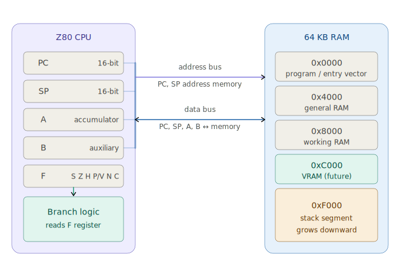

# WPS-Z80 Technical Reference

**Revision:** 5.0 — Milestone 5 (Branching)
**Project:** Schneider CPC 6128 Emulation Layer
**Links:** [LOGBOOK.md](LOGBOOK.md) · [README.md](README.md)

---

## Architecture overview



The emulator models a Zilog Z80 CPU connected to a flat 64 KB RAM space. The CPU fetches opcodes from the program area, executes them, and logs every step to a `.trace` file. The Branch Logic unit reads the Flag Register (F) to decide whether a conditional jump is taken.

---

## Registers

| Register | Width | Role |
|----------|-------|------|
| PC | 16-bit | Program Counter. Points to the next opcode byte. Auto-increments on every fetch. |
| SP | 16-bit | Stack Pointer. Initialise to `0xF000`. Decrements on CALL, increments on RET. |
| A | 8-bit | Accumulator. Primary operand for arithmetic and logic. |
| B | 8-bit | Auxiliary register. Used as a loop counter in the `DEC B / JR NZ` idiom. |
| F | 8-bit | Flag Register. Status bits written by arithmetic ops, read by branch instructions. |

---

## Flag register (F)

Bit layout: `S Z — H — P/V N C` (MSB to LSB).

| Bit | Symbol | Name | Set when |
|-----|--------|------|----------|
| 7 | S | Sign | Result bit 7 is 1 (negative in signed arithmetic). |
| 6 | Z | Zero | Result is exactly zero. |
| 4 | H | Half-Carry | Carry from bit 3 into bit 4 (BCD; not yet used). |
| 2 | P/V | Parity / Overflow | Result parity or signed overflow (not yet used). |
| 1 | N | Add/Subtract | Last operation was a subtraction (not yet used). |
| 0 | C | Carry | Unsigned overflow on addition or borrow on subtraction/compare. |

Flag behaviour per instruction:

| Instruction | Z | C | S | Notes |
|-------------|---|---|---|-------|
| INC A | updated | — | updated | Z set if A wraps to 0x00. |
| DEC B | updated | — | updated | Z set when B reaches 0x00 — loop termination signal. |
| CP n | updated | updated | — | Silent A − n. Z set if equal; C set if A < n. |

---

## Instruction set

### System control

| Opcode | Mnemonic | Bytes | Description |
|--------|----------|-------|-------------|
| 0x00 | NOP | 1 | No operation. |
| 0x76 | HALT | 1 | Stop the execution loop. |

### 8-bit loads

| Opcode | Mnemonic | Bytes | Description |
|--------|----------|-------|-------------|
| 0x06 | LD B, n | 2 | Load immediate byte into B. |
| 0x3E | LD A, n | 2 | Load immediate byte into A. |
| 0x78 | LD A, B | 1 | Copy B into A. |
| 0x32 | LD (nn), A | 3 | Store A at absolute 16-bit address nn. |

### 16-bit loads

| Opcode | Mnemonic | Bytes | Description |
|--------|----------|-------|-------------|
| 0x31 | LD SP, nn | 3 | Load 16-bit immediate into SP. |

### Arithmetic and logic

| Opcode | Mnemonic | Bytes | Flags | Description |
|--------|----------|-------|-------|-------------|
| 0x3C | INC A | 1 | Z, S | Increment A. |
| 0x05 | DEC B | 1 | Z, S | Decrement B. |
| 0xFE | CP n | 2 | Z, C | Compare A with immediate n. Sets flags; result discarded. |

### Unconditional jumps

| Opcode | Mnemonic | Bytes | Description |
|--------|----------|-------|-------------|
| 0xC3 | JP nn | 3 | Absolute jump: PC ← nn. |
| 0x18 | JR e | 2 | Relative jump: PC ← PC + sign\_extend(e). |

### Conditional absolute jumps — JP cc, nn

The 16-bit target is always fetched. PC updates only when the condition is met.

| Opcode | Mnemonic | Condition | Bytes |
|--------|----------|-----------|-------|
| 0xC2 | JP NZ, nn | Z = 0 | 3 |
| 0xCA | JP Z, nn | Z = 1 | 3 |
| 0xD2 | JP NC, nn | C = 0 | 3 |
| 0xDA | JP C, nn | C = 1 | 3 |

### Conditional relative jumps — JR cc, e

The signed 8-bit displacement is always fetched. It is added to PC (already past the JR instruction) only when the condition is met. Range: −126 to +129 bytes from the JR opcode address.

| Opcode | Mnemonic | Condition | Bytes |
|--------|----------|-----------|-------|
| 0x20 | JR NZ, e | Z = 0 | 2 |
| 0x28 | JR Z, e | Z = 1 | 2 |
| 0x30 | JR NC, e | C = 0 | 2 |
| 0x38 | JR C, e | C = 1 | 2 |

**Displacement encoding:** A backward branch of d bytes uses the two's-complement byte `256 − d`. Example: to jump back 3 bytes, encode `0xFD`.

**Canonical counted loop:**
```asm
        LD B, N       ; initialise counter
LOOP:   DEC B         ; decrement; Z set when B reaches 0
        JR NZ, LOOP   ; branch back if Z = 0
```

### Stack and subroutines

| Opcode | Mnemonic | Bytes | Description |
|--------|----------|-------|-------------|
| 0xCD | CALL nn | 3 | Push PC onto stack (SP -= 2), then jump to nn. |
| 0xC9 | RET | 1 | Pop return address from stack into PC (SP += 2). |

---

## Memory map

| Range | Segment | Notes |
|-------|---------|-------|
| 0x0000 – 0x3FFF | Program area | Binary loaded here by the loader. Execution begins at 0x0000. |
| 0x4000 – 0x7FFF | General RAM | User data and variable storage. |
| 0x8000 – 0xBFFF | Working RAM | Register state dumps, inter-routine data. |
| 0xC000 – 0xFFFF | VRAM (reserved) | Future: video buffer and neural observation layer. |
| 0xF000 – 0xFFFF | Stack segment | SP initialised to 0xF000. Stack grows downward into this region. |

---

## Trace engine

Every executed instruction is written to `programs/<name>.trace`.

**Line format:**
```
[PPPP] MNEMONIC_AND_OPERANDS      | A:AA B:BB F:FFFFFFFF [Z:z C:c]
```

| Field | Description |
|-------|-------------|
| `[PPPP]` | PC value at the start of the instruction (hex). |
| Mnemonic | Disassembled instruction, including operands and branch annotation. |
| `A:AA` | Accumulator (hex). |
| `B:BB` | Register B (hex). |
| `F:FFFFFFFF` | Full flag register as 8 binary digits, MSB first. |
| `[Z:z C:c]` | Zero and Carry flags isolated (0 or 1). |

Branch annotations appended to the mnemonic:

| Annotation | Meaning |
|------------|---------|
| `[taken]` | Condition true; PC was updated. |
| `[not taken]` | Condition false; execution falls through. |
| `-> 0xNNNN` | Resolved destination for relative jumps (JR). |

**Safety limit:** Execution halts automatically after 100 cycles (`MAX_CYCLES`). This guard must not be removed.

---

## Toolchain

Compile:
```
g++ main.cpp -o emulator
```

Assemble and run a lesson:
```
python programs/gen_lessonN.py
.\emulator.exe programs\lessonN.bin
```

Each `gen_lessonN.py` is the single source of truth for its program. Running it produces both `lessonN.bin` (the raw binary) and `lessonN.asm` (a human-readable annotated listing). The `.asm` file is generated automatically — never edit it by hand.

---

*(C) 1984 Wocjan Percussive Systems — "Binary precision / analog waves."*